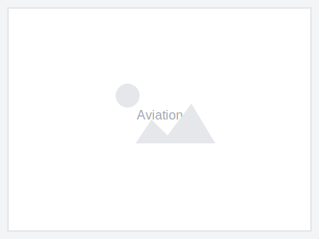
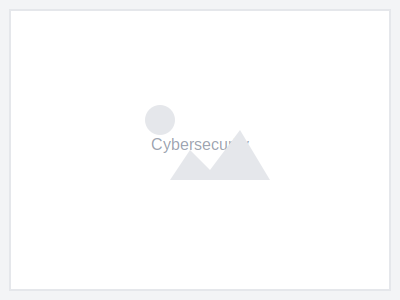
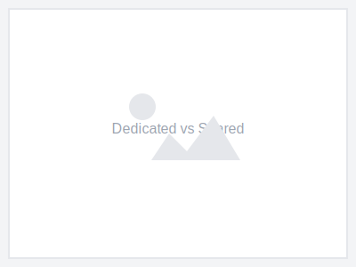

<!-- source: https://www.business.att.com/products/att-dedicated-internet.html -->

| Hero (dark) |
| --- |
|  |
| AT&T Dedicated Internet |
| Fast, reliable fiber and strong security |
| Get enterprise-grade dedicated internet with symmetrical upload and download speeds, proactive threat defense, and 24/7 support. |
| **[Get a quote](#)** [Call 877.460.6464](tel:+18774606464) |

---

| Columns | |
| --- | --- |
|  | **Fast, reliable, secure network connectivity** Get dedicated internet access with symmetrical speeds, proactive threat defense, and cloud-based apps with data loss prevention features. [Learn more](#) |

---

## Why choose AT&T Dedicated Internet

| Columns | |
| --- | --- |
|  **All the speed, all the time** Symmetrical upload and download speeds mean faster file transfers and smoother video calls. |  **Dependability that delivers** 99.99% uptime SLA ensures your business stays connected when it matters most. |  **Proactive threat defense** Network-embedded security helps protect against cyber threats. |  **Backed by the AT&T Guarantee** We stand behind our service with industry-leading support. |

---

| Section Metadata |  |
| --- | --- |
| Style | light-gray |

## Get the right speed for your business

Choose from dedicated internet plans with symmetrical speeds starting at 500Mbps.

| Cards | |
| --- | --- |
|  | **AT&T Dedicated Internet 500Mbps** Get a quote - 500Mbps symmetrical speeds. Reliable, rock-solid connection. Includes AT&T Dynamic Defense Shield. 99.99% uptime SLA. 24/7 expert support. [Get a quote](#) |
|  | **AT&T Dedicated Internet 700Mbps** Get a quote - 700Mbps symmetrical speeds. Includes AT&T Dynamic Defense Advanced. Proactive threat detection. Full data recovery included. [Get a quote](#) |
|  | **AT&T Dedicated Internet 1 GIG** Get a quote - 1 GIG symmetrical speeds. Includes AT&T Dynamic Defense Premium. Enterprise-grade security. Large file transfers in seconds. [Get a quote](#) |

---

## The choice is simple

See why businesses choose AT&T Dedicated Internet.

| Feature | AT&T | Spectrum | Lumen | Comcast |
| --- | --- | --- | --- | --- |
| **Symmetrical speeds** | Yes | | | |
| **Available widely on premise** | Yes | | | |
| **Network embedded DDoS protection** | Yes | | | |
| **Threat reporting** | Yes | | | |
| **Service level agreement** | Yes | | | |
| **24/7 proactive monitoring** | Yes | | | |
| **Traffic prioritization** | Yes | | | |

**[Get a quote](#)** [Call 877.460.6464](tel:+18774606464)

---

## Find Internet services available at your address

Enter your address to see AT&T Dedicated Internet availability at your location.

**[Check availability](#)**

---

| Section Metadata |  |
| --- | --- |
| Style | cyan |

| Columns | |
| --- | --- |
| **AT&T is the only brand to be awarded 8 years in a row** For Customer Satisfaction with a Large Enterprise Network Service - J.D. Power [Learn more](#) |  |

---

## See how our customers secure and protect their networks

| Cards | |
| --- | --- |
|  | **Soaring to new heights** See how AT&T network services helped an aviation company expand to new heights. [Read the story](#) |
|  | **Connect, collaborate, and tow** Learn how a towing company improved fleet connectivity with AT&T Business. [Read the story](#) |
|  | **Defeating a cyberattack** Discover how AT&T Dynamic Defense helped a business defend against threats. [Read the story](#) |

---

| Section Metadata |  |
| --- | --- |
| Style | light-gray |

## Resources

| Cards | |
| --- | --- |
|  | **Tech demystified: What is dedicated internet?** Learn the basics of dedicated internet access. [Read article](#) |
|  | **Experience first-class business internet service** See why businesses choose AT&T Dedicated Internet. [Read article](#) |
|  | **AT&T Dynamic Defense simplifies network security** Learn about network-embedded security. [Read article](#) |
|  | **Should you choose dedicated or shared internet?** Compare the options for your business. [Read article](#) |

---

## Frequently asked questions

### What is AT&T Dedicated Internet service?

AT&T Dedicated Internet is an enterprise-grade internet connection that provides symmetrical upload and download speeds, guaranteed bandwidth, and 24/7 support.

### What is AT&T Dedicated Internet service used for?

Dedicated Internet is ideal for businesses that need reliable, high-performance connectivity for cloud applications, video conferencing, large file transfers, and business-critical operations.

### How do I know what speed plan is right for my business?

Consider your current bandwidth usage, number of employees, and types of applications you use. Our experts can help you determine the right speed tier.

---

| Section Metadata |  |
| --- | --- |
| Style | light-gray |

## Talk to an AT&T Business sales expert

Fill out the form and we'll contact you to discuss your dedicated internet needs.

**[View online](#)**

---

| Metadata |  |
| --- | --- |
| Title | AT&T Dedicated Internet Access for Business |
| Description | Dedicated Internet Access (DIA) is an internet connection dedicated to your business with speeds up to 1TB. Shop best AT&T dedicated internet access for your business. |
| Image |  |
