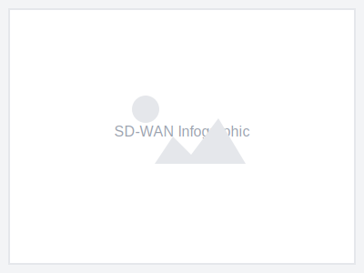
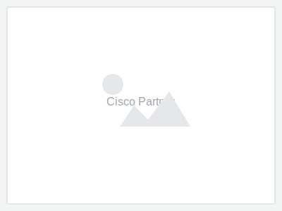
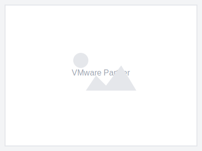
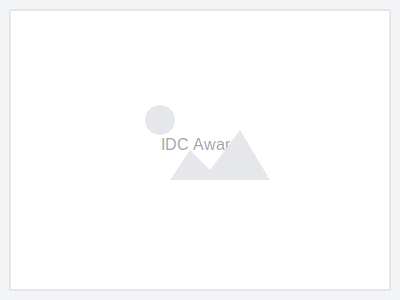

<!-- source: https://www.business.att.com/products/sd-wan.html -->

| Hero (dark) |
| --- |
|  |
| Next-gen network |
| Managed AT&T SD-WAN |
| Transform your connectivity with a secure, intelligent network built for your enterprise's future. |
| **[Request information](#)** [Call sales](tel:+18774606464) |

---

## Amplify agility across your organization

With managed AT&T SD-WAN solutions

| Columns | |
| --- | --- |
|  **Scale quickly** Deploy new locations and applications rapidly with flexible, scalable solutions. |  **Increase performance** Optimize application performance with intelligent traffic routing. |  **Boost visibility** Gain comprehensive insights into your network and application performance. |

| Columns | |
| --- | --- |
|  **Round-the-clock support** Get 24/7/365 expert support from AT&T network specialists. |  **Built-in security** Protect your network with integrated security features and threat detection. |  **Expert guidance** Work with AT&T consultants to design the right solution for your business. |

---

| Section Metadata |  |
| --- | --- |
| Style | light-gray |

| Columns | |
| --- | --- |
| **Get to know your SD-WAN solutions** Learn more about how AT&T will manage your SD-WAN. [View infographic](#) |  |

---

## Boosting customer success with managed SD-WAN

| Columns | |
| --- | --- |
|  | **AT&T SD-WAN in schools** **Solving network outages across multiple campuses** Lincoln Tech students needed a more reliable network for their 20+ skills labs. Discover how AT&T managed SD-WAN solution improved their networking and speed across the network. [Read the case study](#) |

| Columns | |
| --- | --- |
| **AT&T SD-WAN and IoT** **Powering displays in brick-and-mortar stores** A global design-focused appliance maker needed consistent connectivity for its in-store displays. The company switched to a dependable, scalable solution that wasn't reliant on a single network—with a fully managed AT&T solution. [Read the case study](#) |  |

---

## Meet your business needs with our managed SD-WAN partners

| Cards | |
| --- | --- |
|  | **AT&T SD-WAN with Cisco** Fully integrated security plus advanced routing and analytics for enterprise-wide management. [Learn more](#) |
|  | **AT&T SD-WAN with VMware** Software-defined approach with a solution that delivers zero-touch cloud automation. [Learn more](#) |
|  | **AT&T SD-WAN with Aruba** Integrated wired and wireless a single management portal for your WAN. [Learn more](#) |

---

| Section Metadata |  |
| --- | --- |
| Style | light-gray |

## We've got the industry talking

| Cards | |
| --- | --- |
|  | **2024 MEF NaaS Excellence Award for SD-WAN** [Learn more](#) |
|  | **2025 Gartner Magic Quadrant for Global Network Services Leader** [Read the report](#) |
|  | **2024 North American SD-WAN Market Leader** [Read the report](#) |
|  | **2023 Enterprise Network Services Market Leader** [Read the report](#) |

---

## Related products

| Cards | |
| --- | --- |
|  | **Secure Access Service Edge (SASE)** Combine networking and security in a cloud-delivered service. [Learn more](#) |
|  | **AT&T Managed Services** Let AT&T manage your network infrastructure. [Learn more](#) |

---

## Frequently asked questions

### What is SD-WAN?

SD-WAN (Software-Defined Wide Area Network) is a technology that simplifies the management and operation of a WAN by separating the networking hardware from its control mechanism.

### How does SD-WAN work?

SD-WAN uses software to intelligently route traffic across the most efficient path, whether that's MPLS, broadband, or LTE, based on real-time network conditions.

### Why choose managed SD-WAN solutions?

Managed SD-WAN provides expert support, reduced complexity, and optimized performance without the need for in-house expertise.

### Why should I consider investing in SD-WAN?

SD-WAN can reduce costs, improve application performance, and provide greater flexibility compared to traditional WAN architectures.

### What's the difference between SD-WAN and SASE?

SD-WAN focuses on network connectivity and optimization, while SASE (Secure Access Service Edge) combines SD-WAN with cloud-native security services.

### What's the difference between managed and standalone SD-WAN?

Managed SD-WAN includes design, deployment, monitoring, and support from the provider, while standalone requires in-house management.

---

| Section Metadata |  |
| --- | --- |
| Style | light-gray |

## Talk to an AT&T Business sales expert

Call or chat with us to learn more about our business solutions. Or have us contact you. Tell us how we can help. Take a survey. Schedule a call by selecting a day and time that works for you.

**[Contact us](#)**

---

| Metadata |  |
| --- | --- |
| Title | SD-WAN Service Provider - Software Defined Wide Area Network at AT&T Business |
| Description | AT&T business is an SD-WAN service provider. Securely optimize your WAN experience, performance and cost on AT&T's software defined wide area network. |
| Image |  |
