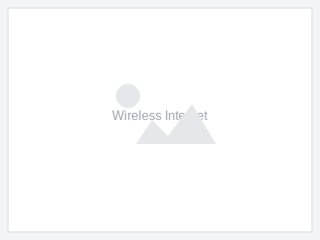
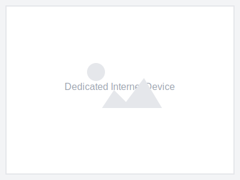

<!-- source: https://www.business.att.com/products/wireless-internet.html -->

| Hero (dark) |
| --- |
|  |
| Fast, reliable internet starting at $30/mo. |
| AT&T Internet Air for Business |
| Get fast 5G wireless internet with no annual contract and professional installation included. |
| **[Check availability](#)** [Call 877.595.0742](tel:+18775950742) |

---

## Enter your address to get started

Check if AT&T Internet Air for Business is available at your location.

**[Check availability](#)**

---

## Fast, reliable, and built for business

| Cards | |
| --- | --- |
|  | **AT&T Internet Air for Business** Starting at $30/mo. - Fast 5G wireless speeds. No annual contract. Professional installation included. Perfect for small businesses. [Check availability](#) |
|  | **AT&T Dedicated Internet** For businesses that need guaranteed speeds and reliability. Symmetrical upload and download speeds. Service Level Agreement included. [Learn more](/products/att-dedicated-internet.html) |

---

| Section Metadata |  |
| --- | --- |
| Style | light-gray |

## Get up and running quickly

| Columns | |
| --- | --- |
|  **Free professional setup** Our technicians will install and set up your equipment at no extra cost. |  **No annual contract** Month-to-month flexibility without long-term commitments. |  **Fast activation** Get connected quickly with our streamlined installation process. |

---

## Get rewarded for joining AT&T

| Cards | |
| --- | --- |
|  | **Get up to a $100 reward card** Order AT&T Internet Air for Business online and receive a Visa Reward Card. Limited time offer. [See offer details](#) |

---

## Get up and running in four easy steps

1. **Check availability** - Enter your address to see if AT&T Internet Air is available in your area.
2. **Choose your plan** - Select the plan that fits your business needs.
3. **Schedule installation** - Pick a time that works for your schedule.
4. **Get connected** - Our technician installs your equipment and you're online.

---

| Columns | |
| --- | --- |
|  | **Your reliable wireless internet solution** AT&T Internet Air for Business delivers fast, reliable 5G wireless internet to help keep your business connected. With no annual contract and professional installation included, getting started is easy. [Check availability](#) |

---

| Section Metadata |  |
| --- | --- |
| Style | light-gray |

| Columns | |
| --- | --- |
|  **We're here to help** Have questions? Our business experts are ready to assist you. [Call 877.595.0742](tel:+18775950742) |  **Chat with us** Get answers to your questions through our online chat. [Start chat](#) |

---

## Frequently asked questions

### What is AT&T Internet Air for Business?

AT&T Internet Air for Business is a 5G fixed wireless internet service that delivers fast, reliable connectivity to your business without the need for wired infrastructure.

### How fast is AT&T Internet Air?

Speeds vary by location, but AT&T Internet Air can deliver download speeds that support most business applications including video conferencing, cloud services, and more.

### Is there a contract required?

No, AT&T Internet Air for Business is available month-to-month with no annual contract required.

---

| Section Metadata |  |
| --- | --- |
| Style | light-gray |

## Talk to an AT&T sales expert

Fill out the form and we'll contact you to discuss your business needs.

**[View online](#)**

---

| Metadata |  |
| --- | --- |
| Title | Business Fixed Wireless Internet - AT&T Internet Air for Business |
| Description | AT&T Internet Air for Business offers reliable 5G fixed wireless internet provider service at the best price. Call 877-595-0742 to check availability. |
| Image |  |
